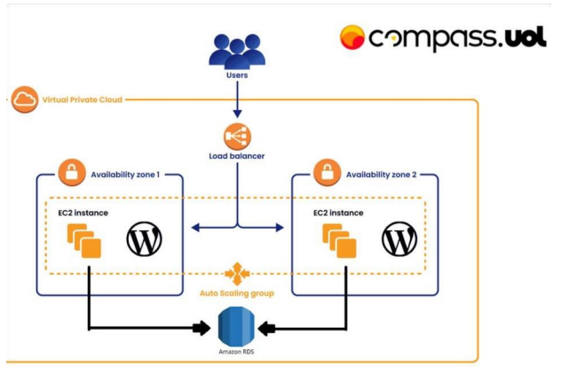
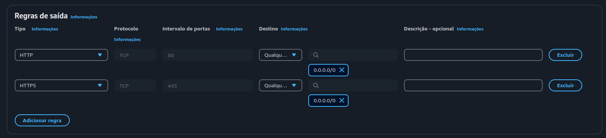
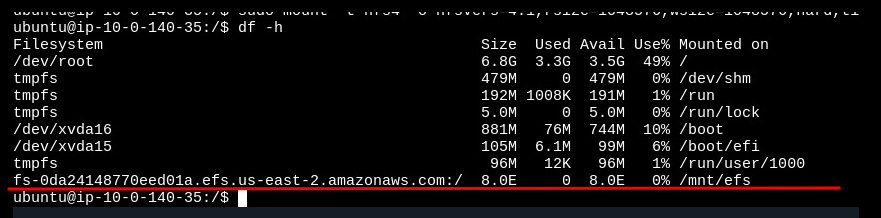
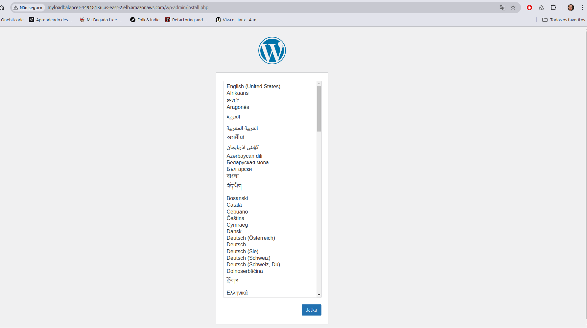

# Ambiente Wordpress EC2-AWS

## Sobre o Projeto
Este projeto implementa um ambiente WordPress utilizando a infraestrutura da AWS. A configuração foi projetada para ser escalável, segura e funcional, abrangendo os seguintes pontos principais:

- Criação de VPC
- RDS (Banco de Dados MySQL)
- EFS (Elastic File System)
- Instâncias EC2
- Load Balancer
- Auto Scaling
- Bastion Host

## Arquitetura do projeto



## Tecnologias Utilizadas
- AWS Console
- Shell Script
- Linux
- Docker

## Objetivo
Implementar um ambiente WordPress confiável, seguro e escalável, utilizando práticas recomendadas para recursos da AWS.

## Criação da VPC
Na primeira etapa, foi necessário criar uma nova VPC para organizar os recursos.

**Parâmetros utilizados:**
- **Bloco CIDR IPv4:** `10.0.0.0/16`
- **Número de Zonas de Disponibilidade (AZs):** 2
- **Sub-redes:** 2 públicas e 2 privadas
- **Gateway NAT:** Ativamos 1 por AZ, assim a própria aws configura nossas conexões internas.

### Sobre o Gateway NAT
O Gateway NAT (Network Address Translation) permite que as instâncias em sub-redes privadas acessem a internet para realizar atualizações e outras tarefas, sem expor essas instâncias diretamente à internet.


|:--|
| Configuração VPC: Todas as opções marcadas são necessarias para o funcionamento. |

---

## Grupos de Segurança
Após criar a VPC, seguimos para a configuração dos Grupos de Segurança, que definem as regras de entrada e saída.

**Grupos criados:**
1. **MyGroup-loadbalancer:**
   - HTTP e HTTPS -> Qualquer IPV4
2. **MyGroup-ec2:**
   - HTTP -> Redireciona para o Load Balancer
   - SSH -> Qualquer IP
   - HTTPS -> Redireciona para o Load Balancer
3. **MyGroup-rds:**
   - MySQL/Aurora -> Origem: MyGroup-ec2
4. **MyGroup-efs:**
   - Tipo: NFS -> Origem: MyGroup-ec2

**Nota:** É importante seguir a ordem correta na criação dos grupos de segurança para garantir a configuração adequada:

1. **Load Balancer:** Deve ser criado primeiro, permitindo tráfego HTTP e HTTPS de qualquer IP.
2. **EC2:** Crie em seguida, referenciando o grupo de segurança do Load Balancer como origem para HTTP e HTTPS.
3. **RDS e EFS:** Crie por último, configurando suas origens com base no grupo de segurança do EC2, garantindo que somente as instâncias autorizadas possam acessar esses serviços.


|:--|
| Grupo de Segurança Load Balancer: Regras de entrada livres para qualquer ipv4. |


|:--|
| Grupo de Segurança EC2: As regras de entrada tendo como origem o grupo do load balancer. |


|:--|
| Grupo de Segurança do RDS: As regras de entrada tendo como origem o EC2, mesma lógica para o EFS. |

---

## Criação do RDS

O RDS (Relational Database Service) é um serviço que simplifica a configuração, manutenção e escalabilidade de bancos de dados relacionais como MySQL e PostgreSQL. Utilizar grupos de sub-redes em sub-redes privadas é fundamental para aumentar a segurança, pois impede o acesso direto à internet, limitando conexões apenas a instâncias autorizadas. Por isso primeiramente criaremos o Grupo de sub-redes privadas.

### Criação do Grupo de Sub-redes Privadas
1. **Acessar a seção de sub-redes no RDS:**
   - No console da AWS, vá até o serviço RDS e acesse a aba "Grupos de sub-redes".
2. **Criar um novo grupo de sub-redes:**
   - Clique em "Criar grupo de sub-redes".
3. **Preencher as informações básicas:**
   - **Nome do grupo:** `private-subnet-group`
   - **Descrição:** "Grupo contendo sub-redes privadas da VPC"
   - **VPC:** Selecione a VPC previamente criada para o projeto.
4. **Selecionar as zonas de disponibilidades.**
5. **Selecionar apenas sub-redes privadas.**
6. **Salvar o grupo:** Clique em "Criar grupo".


|:--|
| Configuração do Grupo de sub-redes: Com essas configurações, você estará apto para seguir. |

### Configurações principais do RDS
- **Tipo de banco de dados:** MySQL (Nível gratuito).
- **Identificador da instância:** `wordpress-db`
- **Nome de usuário principal:** `admin`
- **Senha:** **********
- **Instância:** `db.t3.micro`
- **Backup e criptografia:** Desativados (para ambiente de teste).

### Conectividade
- **VPC:** Selecionar a VPC criada.
- **Grupo de sub-redes:** Selecionar grupo criado anteriormente.
- **Acesso público:** "Não".
- **Grupo de segurança:** MyGroup-rds.

### Configurações adicionais
- **Nome do banco de dados:** `wordpress`
- **Escalabilidade automática do armazenamento:** Desmarcar.


|:--|
| IMPORTANTE: Se você não configurar essa parte, o script automatizado não funcionará. |

## RDS pronto

Com o RDS configurado e online, é possível obter o endereço IP do banco de dados. Esse IP deve ser copiado e inserido no arquivo `user_data.sh`, especificamente na seção do Docker Compose. No parâmetro `WORDPRESS_DB_HOST`, insira o IP do RDS. Além disso, preencha os valores de `WORDPRESS_DB_USER`, `WORDPRESS_DB_PASSWORD` e `WORDPRESS_DB_NAME`, assegurando que sejam consistentes com as informações configuradas anteriormente. Por padrão, o nome do banco já está definido como `wordpress`.

---

## Criação do EFS
Configuramos o Amazon Elastic File System (EFS) para compartilhamento de arquivos entre instâncias.

**Configurações principais:**
- **Nome:** `MyEFS`
- **VPC:** Selecionar a VPC criada.
- **Zonas de disponibilidade:** Sub-redes privadas 1 e 2.
- **Grupo de segurança:** MyGroup-efs.

### Sobre o EFS
O EFS é um sistema de arquivos escalável e elástico que permite que várias instâncias EC2 acessem os mesmos dados simultaneamente.

### Após a criação
1. Espere o sistema de arquivos subir.
2. Acesse a aba de anexar e copie o comando em "Usando o cliente do NFS".
3. Utilize o comando no script para montar o EFS nas instâncias:
   ```bash
   # Cria o diretório EFS
   sudo mkdir -p /mnt/efs  

   # Monta o sistema de arquivos da Amazon EFS
   sudo mount -t nfs4 -o nfsvers=4.1,rsize=1048576,wsize=1048576,hard,timeo=600,retrans=2,noresvport <id-amazon>:/ /mnt/efs

---

## Criação das EC2
Para este projeto, criamos duas instâncias EC2.

### Configurações principais:
- **Nome e tags:** Definir conforme o padrão da equipe.
- **Sistema operacional:** Ubuntu.
- **Tipo de instância:** Manter padrão.
- **Par de chaves:** Criar ou reutilizar o par de chaves existente.
- **Sub-redes:**
  - **Instância 1:** Sub-rede privada 1.
  - **Instância 2:** Sub-rede privada 2.
- **Atribuir IP público automaticamente:** Habilitado.
- **Grupo de segurança:** `MyGroup-ec2`.

### Configuração avançada (User Data):
Inserir o script `user_data.sh` para inicializar as instâncias automaticamente.

---

## Bastion Host
Para acessar as instâncias privadas via SSH, configuramos um Bastion Host em uma sub-rede pública.

### Passos principais:
1. **Criar uma instância EC2:** Configurada em uma sub-rede pública.
2. **Conectar ao Bastion Host via SSH.**
3. **A partir do Bastion Host, acessar as instâncias privadas utilizando o comando:**
   ```bash
   ssh -i "mykeys.pem" ubuntu@<ip-privado>
---
3.1. **Lembrando que mykeys.pem deve ser passado para o bastion host manualmente e aplicar o comando `chmod 400 mykeys.pem` para apenas o proprietário ter acesso de leitura a chave.**

4. **Podemos verificar se o mount do EFS funcionou. Utilizando o comando `df -h`, vai retornar os discos do sistema e um deles terá o mesmo código fornecido pelo EFS, indicando assim que funcionou.**


|:--|
| Exemplo: Ao acessar e executar o comando `df -h` você deve ver algo como na imagem. |

---

## Configuração do Load Balancer
O Load Balancer é uma ferramenta essencial para distribuir o tráfego de forma equilibrada entre as instâncias EC2, garantindo alta disponibilidade e desempenho do ambiente. Ele atua como um ponto único de entrada, redirecionando as solicitações de usuários para as instâncias ativas de maneira uniforme. Também permite escalabilidade, integrando-se com o Auto Scaling para ajustar dinamicamente a capacidade com base na demanda.

### Configurações principais:
- **Tipo:** Classic Load Balancer.
- **Nome:** `MyLoadBalancer`.
- **Mapeamento de rede:** Sub-redes públicas.
- **Grupo de segurança:** `MyGroup-loadbalancer`.


|:--|
| Pontos importantes: Selecionar as sub redes públicas e seu grupo de segurança. |

### Verificação de integridade:
- **Caminho de ping:** `/wp-admin/install.php` (espera-se retorno com status 200).

### Integrar as instâncias:
- **Clicar em ->** Adicionar instâncias.
- Selecionar as duas instâncias que criamos privadas que criamos no tópico de EC2.

Após configurado, o Load Balancer gera um DNS que pode ser utilizado para acessar o ambiente wordpress, indepedente da instância.

---

## Configuração de Auto Scaling
O Auto Scaling é responsável por ajustar automaticamente o número de instâncias EC2 com base na demanda do tráfego ou nas métricas de desempenho definidas, como uso de CPU, memória ou número de conexões ativas. Ele permite que o ambiente seja dimensionado horizontalmente, adicionando instâncias durante picos de acesso para manter a performance, e removendo-as em períodos de baixa utilização para reduzir custos. Essa flexibilidade garante que o sistema se mantenha eficiente, resiliente e econômico, atendendo às necessidades dos usuários sem interrupções. Além disso, o Auto Scaling trabalha em conjunto com o Load Balancer para incluir ou excluir instâncias de maneira transparente, sem impactar o funcionamento do ambiente.

### Passos principais:
1. **Criar um modelo de execução (template):**
   - **Tipo de instância:** `t2.micro`.
   - **Tags e script User Data:** Iguais às instâncias EC2 criadas anteriormente.
2. **Configurar as zonas de disponibilidade:** Sub-redes privadas.
3. **Integrar ao Load Balancer existente.**
4. O restante das configurações pode deixar default.

Após a conclusão da configuração do AutoScaling, será criada uma nova instância automaticamente. Isso indica que tudo ocorreu de forma correta.

## Conclusão

Acessando pelo DNS do LoadBalancer:


|:--|
| Tela Inicial: Aqui vemos a tela inicial de configuração do wordpress. |

Este projeto demonstrou a criação de um ambiente WordPress robusto e escalável, utilizando os principais recursos oferecidos pela AWS. Desde a configuração de uma VPC personalizada até a integração de serviços como RDS, EFS, EC2, Load Balancer e Auto Scaling, cada etapa foi planejada para garantir desempenho, segurança e alta disponibilidade.
Este ambiente pode ser expandido ou adaptado para novos cenários, confirmando a versatilidade e a eficiência da arquitetura criada. Ele representa uma base sólida para futuros projetos, tanto para aprendizado quanto para uso em produção.
Trabalhar neste projeto foi uma experiência nova, que impulsionou meu crescimento intelectual e me permitiu explorar novas tecnologias na prática, algo que antes só conhecia teoricamente. Apesar das dificuldades e erros ao longo do caminho, fui capaz de entender o funcionamento de diversos processos e aprimorar minhas habilidades em DevOps. Essa jornada me proporcionou um aprendizado significativo e me preparou para enfrentar desafios futuros com mais confiança e competência.

---

## Agradecimento
**Quero agradecer a instrutores e colegas que me ajduaram nessa jornada, mesmo com apenas um detalhe, sou grato por:**
- Davi Santos
- Thiago Geremias
- Ana Soares
- Iago Vitor
- Kevin Alencar
- Mannaryelly
- Paulo Henrique
- Raianne Evellyn
- Tales Santos
- Thais Oliveira
