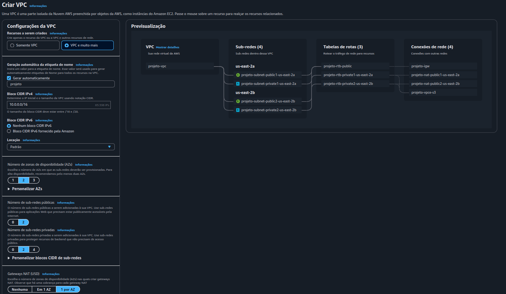
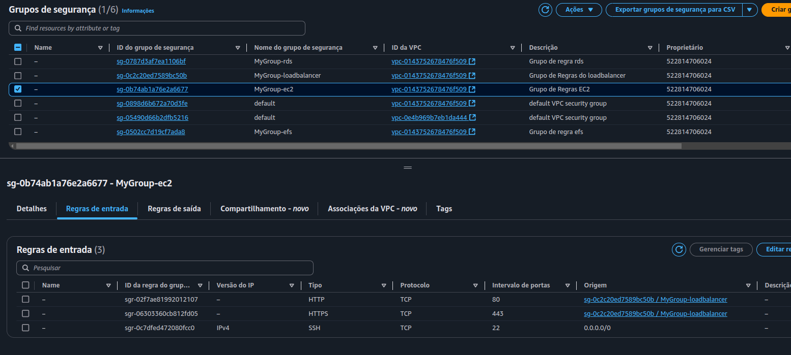
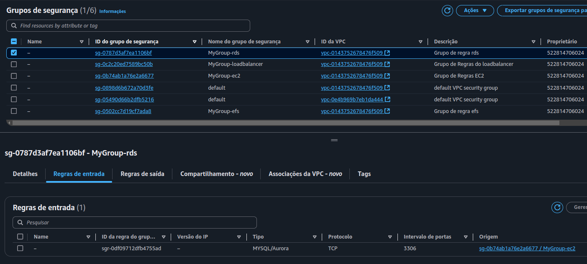
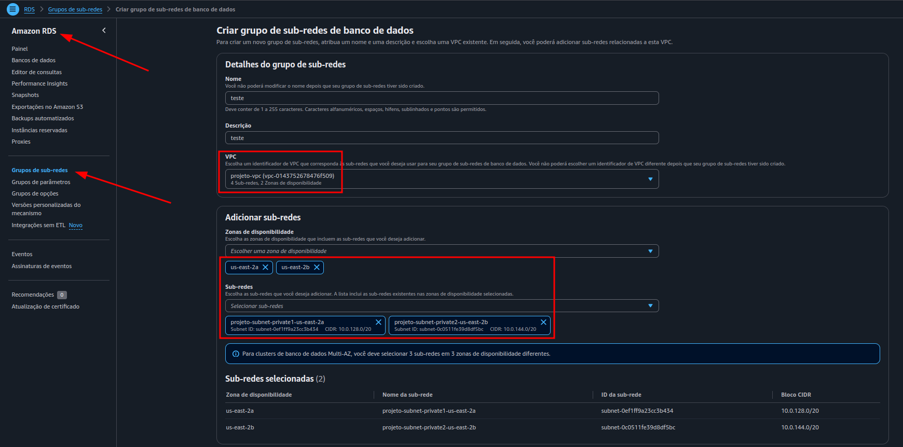
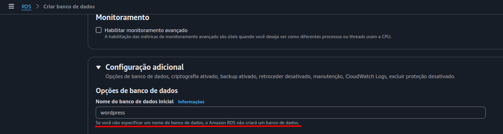
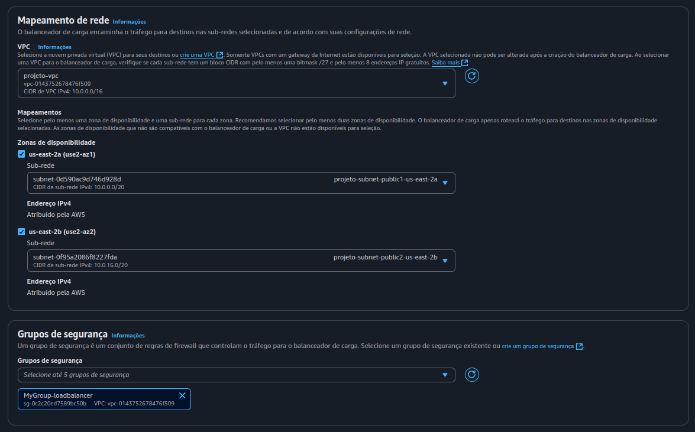

# Configuração de Ambiente AWS para WordPress

## Criação da VPC
Na primeira etapa, foi necessário criar uma nova VPC para organizar os recursos.

**Parâmetros utilizados:**
- **Bloco CIDR IPv4:** `10.0.0.0/16`
- **Número de Zonas de Disponibilidade (AZs):** 2
- **Sub-redes:** 2 públicas e 2 privadas
- **Gateway NAT:** Configurado nesta etapa.

### Sobre o Gateway NAT
O Gateway NAT (Network Address Translation) permite que as instâncias em sub-redes privadas acessem a internet para realizar atualizações e outras tarefas, sem expor essas instâncias diretamente à internet.



---

## Grupos de Segurança
Após criar a VPC, seguimos para a configuração dos Grupos de Segurança, que definem as regras de entrada e saída.

**Grupos criados:**
1. **MyGroup-loadbalancer:**
   - HTTP e HTTPS -> Qualquer IP
2. **MyGroup-ec2:**
   - HTTP -> Redireciona para o Load Balancer
   - SSH -> Qualquer IP
   - HTTPS -> Redireciona para o Load Balancer
3. **MyGroup-rds:**
   - MySQL -> Origem: MyGroup-ec2
4. **MyGroup-efs:**
   - Tipo: NFS -> Origem: MyGroup-ec2

**Nota:** É necessário criar o grupo de regras da EC2 antes de configurar o grupo do RDS, pois o RDS depende das regras da EC2 para definir a origem de conexão MySQL.




---

## Criação do RDS

### Criação do Grupo de Sub-redes Privadas
1. **Acessar a seção de sub-redes na VPC:**
   - No console da AWS, vá até o serviço VPC e acesse a aba "Grupos de sub-redes".
2. **Criar um novo grupo de sub-redes:**
   - Clique em "Criar grupo de sub-redes".
3. **Preencher as informações básicas:**
   - **Nome do grupo:** `private-subnet-group`
   - **Descrição:** "Grupo contendo sub-redes privadas da VPC"
   - **VPC:** Selecione a VPC previamente criada para o projeto.
4. **Selecionar apenas sub-redes privadas.**
5. **Salvar o grupo:** Clique em "Criar grupo".



### Configurações principais do RDS
- **Tipo de banco de dados:** MySQL (Nível gratuito).
- **Identificador da instância:** `wordpress-db`
- **Nome de usuário principal:** `admin`
- **Senha:** **********
- **Instância:** `db.t3.micro`
- **Backup e criptografia:** Desativados (para ambiente de teste).

### Conectividade
- **VPC:** Selecionar a VPC criada.
- **Grupo de sub-redes:** Selecionar grupo criado anteriormente.
- **Acesso público:** "Não".
- **Grupo de segurança:** MyGroup-rds.

### Configurações adicionais
- **Nome do banco de dados:** `wordpress`
- **Escalabilidade automática do armazenamento:** Desmarcar.



---

## Criação do EFS
Configuramos o Amazon Elastic File System (EFS) para compartilhamento de arquivos entre instâncias.

**Configurações principais:**
- **Nome:** `MyEFS`
- **VPC:** Selecionar a VPC criada.
- **Zonas de disponibilidade:** Sub-redes privadas 1 e 2.
- **Grupo de segurança:** MyGroup-efs.

### Sobre o EFS
O EFS é um sistema de arquivos escalável e elástico que permite que várias instâncias EC2 acessem os mesmos dados simultaneamente.

### Após a criação
1. Espere o sistema de arquivos subir.
2. Acesse a aba de anexar e copie o comando em "Usando o cliente do NFS".
3. Utilize o comando no script para montar o EFS nas instâncias:
   ```bash
   # Cria o diretório EFS
   sudo mkdir -p /mnt/efs  

   # Monta o sistema de arquivos da Amazon EFS
   sudo mount -t nfs4 -o nfsvers=4.1,rsize=1048576,wsize=1048576,hard,timeo=600,retrans=2,noresvport <id-amazon>:/ /mnt/efs

## Criação das EC2
Para este projeto, criamos duas instâncias EC2.

### Configurações principais:
- **Nome e tags:** Definir conforme o padrão da equipe.
- **Sistema operacional:** Ubuntu.
- **Tipo de instância:** Manter padrão.
- **Par de chaves:** Criar ou reutilizar o par de chaves existente.
- **Sub-redes:**
  - **Instância 1:** Sub-rede privada 1.
  - **Instância 2:** Sub-rede privada 2.
- **Atribuir IP público automaticamente:** Habilitado.
- **Grupo de segurança:** `MyGroup-ec2`.

### Configuração avançada (User Data):
Inserir o script `user_data.sh` para inicializar as instâncias automaticamente.

---

## Configuração do Load Balancer
O Load Balancer distribui o tráfego de forma equilibrada entre as instâncias.

### Configurações principais:
- **Tipo:** Classic Load Balancer.
- **Nome:** `MyLoadBalancer`.
- **Mapeamento de rede:** Sub-redes públicas.
- **Grupo de segurança:** `MyGroup-loadbalancer`.



### Verificação de integridade:
- **Caminho de ping:** `/wp-admin/install.php` (espera-se retorno com status 200).

### Integrar as instâncias:
- **Clicar em ->** Adicionar instâncias.
- Selecionar as duas instâncias que criamos anteriormente.

Após configurado, o Load Balancer gera um DNS que pode ser utilizado para acessar o ambiente wordpress, indepedente da instância.

---

## Configuração de Auto Scaling
O Auto Scaling ajusta automaticamente o número de instâncias com base na demanda.

### Passos principais:
1. **Criar um modelo de execução (template):**
   - **Tipo de instância:** `t2.micro`.
   - **Tags e script User Data:** Iguais às instâncias EC2 criadas anteriormente.
2. **Configurar as zonas de disponibilidade:** Sub-redes privadas.
3. **Integrar ao Load Balancer existente.**

---

## Bastion Host
Para acessar as instâncias privadas via SSH, configuramos um Bastion Host em uma sub-rede pública.

### Passos principais:
1. **Criar uma instância EC2:** Configurada em uma sub-rede pública.
2. **Conectar ao Bastion Host via SSH.**
3. **A partir do Bastion Host, acessar as instâncias privadas utilizando o comando:**
   ```bash
   ssh -i "mykeys.pem" ubuntu@<ip-privado>
4. **Podemos verificar se o mount do EFS funcionou. Utilizando o comando `df -h`, vai retornar os discos do sistema e um deles terá o mesmo código fornecido pelo EFS, indicando assim que funcionou.**
